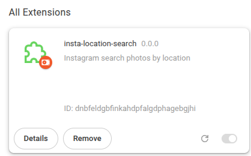
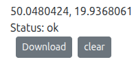

# Instagram location search

### How to install

Following step describes Chrome setup steps but release also includes firefox extension.

1. Download [extension](https://github.com/henhenkok/insta-location-search/releases/download/latest/insta-location-search-0.0.0-chrome.zip)
2. Unpack archive in some persistent location on your computer
3. open `chrome://extensions/`
4. Enable dev mode
5. click on load unpacked
6. select load unpacked

Extension should arrive in extensions list:

### How to use
1. insert your coordinates and search
2. Result should be generated

NOTE result is stored in browser no data submission happens(you can check code)

3. Click download to get GeoJSON result with url of instagram locations around target area.
4. Click clear to reset for form.